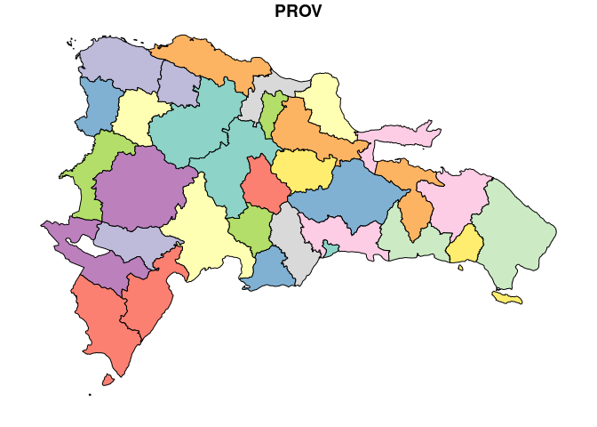

Unidad 1, asignación 1: datos espaciales en R
=============================================

Por lo pronto, ayudaré con `...`. Donde quiera que los veas, deberás sustituirlos por lo que indique el correspondiente mandato. "No te aco'tumbre".

Dentro de las opciones de `knitr`, en el encabezado de este archivo, es probable que encuentres el argumento `eval = F`. Antes de tejer debes cambiarlo a `eval = T`, para que evalúe los bloques de código según tus cambios.

Mis primeros mapas en R con *simple features*
---------------------------------------------

### Provincia asignada

Toma nota del código de tu provincia asignada aleatoriamente.

``` r
 # abreviatura provaleatoria
 #       acade            11
 #       agrie            09
 #       aleir            10
 #       arqco            16
 #       cindy            12
 #       franc            23
 #       geora            08
 #       hoyod            22
 #       ingan            07
 #       ingdi            19
 #       itac9            15
 #       ivanv            25
 #       lbine            30
 #       leona            24
 #       magda            20
 #       maryj            02
 #       masue            26
 #       mmvol            13
 #       naui2            29
 #       rober            27
 #       wilne            06
 #       yoenn            21
```

### Paquete `sf`

-   Carga el paquete `sf`, con el que podrás importar y manipular objetos *simple features*.

``` r
library(sf)
## Linking to GEOS 3.7.1, GDAL 2.4.2, PROJ 5.2.0
```

### Todas las provincias

-   Carga a la memoria la capa de provincias del archivo GeoPackage.
    -   Primero determina cómo se denomina la capa de provincias usando la función `st_layers`. En esta función, escribe la ruta del archivo (el único GeoPackage dentro de la carpeta `data`. La ruta será algo tal que `data/...`). La función devolverá los nombres de las capas disponibles. Toma nota del nombre de la capa de provincias (es intuitivo).
    -   Con dicha información, carga la capa de provincias con la función `st_read`, asignando al objeto `prov`. En el argumento `dsn` debes escribir la ruta del GeoPackage, y en `layer` el nombre de la capa.
-   Genera un panel de mapas mediante `plot`, donde se muestre el objeto representado según todas sus columnas disponibles (se deberían generar 4 mapas en un panel, uno por cada campo).
-   Genera un mapa mediante `plot` donde se muestre el objeto representado según la columna `PROV`.

``` r
st_layers('data/divisionRD.gpkg')
## Driver: GPKG 
## Available layers:
##      layer_name geometry_type features fields
## 1 PROVCenso2010       Polygon       32      4
## 2  MUNCenso2010       Polygon      155      5
## 3  REGCenso2010       Polygon       10      2
prov <- st_read(dsn = 'data/divisionRD.gpkg', layer = 'PROVCenso2010')
## Reading layer `PROVCenso2010' from data source `/home/yoenn/unidad-1-asignacion-1-datos-espaciales-en-r-yurbaez/data/divisionRD.gpkg' using driver `GPKG'
## Simple feature collection with 32 features and 4 fields
## geometry type:  MULTIPOLYGON
## dimension:      XY
## bbox:           xmin: 182215.8 ymin: 1933532 xmax: 571365.3 ymax: 2205216
## epsg (SRID):    32619
## proj4string:    +proj=utm +zone=19 +datum=WGS84 +units=m +no_defs
plot(prov)
```


``` r
plot(prov['PROV'])
```



### Mi provincia asignada

-   Genera un mapa de tu provincia asignada representando sólo el campo `PROV`. Nota que para elegir tu provincia asignada, necesitarás colocar el código de la misma dentro de los apóstrofos del índice de filas `prov$PROV %in% ''`.
-   Genera un objeto `sf` que sólo contenga tu provincia asignada mediante un subconjunto usando el índice de filas. Denomínalo `miprov`. El nuevo objeto podrás usarlo posteriormente.
-   Imprime el objeto `miprov`. "Imprimir" en este contexto consiste en mostrar el objeto (normalmente un resumen de éste) de acuerdo a su clase. Para ello basta con escribir su nombre y presionar `<entrer>`.
-   un panel de mapas mediante `plot`, donde se muestre `miprov` representado según todas sus columnas disponibles.

``` r
plot(prov[prov$PROV %in% '21', 'PROV'])
```


``` r
miprov <- prov[prov$PROV %in% '21', ]
miprov
## Simple feature collection with 1 feature and 4 fields
## geometry type:  MULTIPOLYGON
## dimension:      XY
## bbox:           xmin: 354135.1 ymin: 2015756 xmax: 394115.5 ymax: 2080005
## epsg (SRID):    32619
## proj4string:    +proj=utm +zone=19 +datum=WGS84 +units=m +no_defs
##    PROV REG     TOPONIMIA ENLACE                           geom
## 21   21  05 SAN CRISTÓBAL   0521 MULTIPOLYGON (((377168.7 20...
plot(miprov)
```


Cálculos, operaciones geométricas
---------------------------------

Nota que hasta este punto sólo realizaste mapas. En esta sección, realizarás cálculos y operaciones geométricas básicas. Además del paquete `sf` ya cargado, necesitarás la colección `tidyverse`.

### Paquetes

``` r
library(tidyverse)
## ── Attaching packages ──────────────────────────────────────────────────────────────────────── tidyverse 1.2.1 ──
## ✔ ggplot2 3.2.1     ✔ purrr   0.3.3
## ✔ tibble  2.1.3     ✔ dplyr   0.8.3
## ✔ tidyr   1.0.0     ✔ stringr 1.4.0
## ✔ readr   1.3.1     ✔ forcats 0.4.0
## ── Conflicts ─────────────────────────────────────────────────────────────────────────── tidyverse_conflicts() ──
## ✖ dplyr::filter() masks stats::filter()
## ✖ dplyr::lag()    masks stats::lag()
```

### Área provincial

-   Calcula el área de cada provincia y asígnala a una nueva columna denominada `areaenm2` dentro del propio objeto `prov`.
-   Imprime la tabla `prov` mostrando sólo las columnas `TOPONIMIA` y `areaenm2` recién creada. Se mostrará también la columna geométrica.

``` r
prov$areaenm2 <- st_area(prov)
as.data.frame(prov[,c('TOPONIMIA','areaenm2')])
##                 TOPONIMIA         areaenm2                           geom
## 1       DISTRITO NACIONAL   91418653 [m^2] MULTIPOLYGON (((406845.9 20...
## 2                    AZUA 2682046342 [m^2] MULTIPOLYGON (((322129.5 20...
## 3                 BAORUCO 1284708786 [m^2] MULTIPOLYGON (((271940 2060...
## 4                BARAHONA 1660431543 [m^2] MULTIPOLYGON (((291856.5 20...
## 5                 DAJABÓN 1020748777 [m^2] MULTIPOLYGON (((245433.3 21...
## 6                  DUARTE 1649482699 [m^2] MULTIPOLYGON (((374434.8 21...
## 7              ELÍAS PIÑA 1395600062 [m^2] MULTIPOLYGON (((235630.8 21...
## 8                EL SEIBO 1788802022 [m^2] MULTIPOLYGON (((523436.4 20...
## 9               ESPAILLAT  841911074 [m^2] MULTIPOLYGON (((385993.5 21...
## 10          INDEPENDENCIA 1770605309 [m^2] MULTIPOLYGON (((205698.2 20...
## 11          LA ALTAGRACIA 2996054190 [m^2] MULTIPOLYGON (((516555.9 20...
## 12              LA ROMANA  651751294 [m^2] MULTIPOLYGON (((528168.4 20...
## 13                LA VEGA 2292669004 [m^2] MULTIPOLYGON (((346936.3 21...
## 14 MARÍA TRINIDAD SÁNCHEZ 1206470733 [m^2] MULTIPOLYGON (((421364.4 21...
## 15           MONTE CRISTI 1882502410 [m^2] MULTIPOLYGON (((207310.8 21...
## 16             PEDERNALES 2080060436 [m^2] MULTIPOLYGON (((219553.5 19...
## 17                PERAVIA  784977080 [m^2] MULTIPOLYGON (((374405.7 20...
## 18           PUERTO PLATA 1806137393 [m^2] MULTIPOLYGON (((356467.6 21...
## 19       HERMANAS MIRABAL  427029190 [m^2] MULTIPOLYGON (((368431.6 21...
## 20                 SAMANÁ  862890693 [m^2] MULTIPOLYGON (((470705.9 21...
## 21          SAN CRISTÓBAL 1240767419 [m^2] MULTIPOLYGON (((377168.7 20...
## 22               SAN JUAN 3364441596 [m^2] MULTIPOLYGON (((293711.7 21...
## 23   SAN PEDRO DE MACORÍS 1253651531 [m^2] MULTIPOLYGON (((452573.4 20...
## 24        SANCHEZ RAMÍREZ 1185680039 [m^2] MULTIPOLYGON (((404915 2106...
## 25               SANTIAGO 2806872887 [m^2] MULTIPOLYGON (((337821 2158...
## 26     SANTIAGO RODRÍGUEZ 1148163890 [m^2] MULTIPOLYGON (((270283.9 21...
## 27               VALVERDE  822697214 [m^2] MULTIPOLYGON (((276526.9 21...
## 28         MONSEÑOR NOUEL  991982567 [m^2] MULTIPOLYGON (((355595.2 21...
## 29            MONTE PLATA 2602392844 [m^2] MULTIPOLYGON (((422830.4 21...
## 30             HATO MAYOR 1317574849 [m^2] MULTIPOLYGON (((480565.4 21...
## 31       SAN JOSÉ DE OCOA  853647045 [m^2] MULTIPOLYGON (((358342 2071...
## 32          SANTO DOMINGO 1301430977 [m^2] MULTIPOLYGON (((439801.8 20...
```

### Ordenar provincias

-   Genera una tabla de provincias sólo con las columnas `TOPONIMIA` y `areaenm2`, y ordénalas de mayor a menor usando el campo `areaenm2`. Aunque puedes ejecutar una tubería de manera fluida y en una sola línea, te recomiendo hacerlo paso a paso, para que explores el efecto de cada verbo y la funcionalidad del operador `pipe` (`%>%`).
    -   Primero asegúrate de que el objeto `prov` está disponible imprimiéndolo. El encabezado del resumen debería mostrar algo tal que `Simple feature collection with 32 features and 5 fields`.
    -   Deshazte de la columna geométrica, mediante la función `st_drop_geometry()`. Esto devolverá el objeto como `data.frame` (el objeto `prov` se mantendrá como `sf`, sólo estarás generando un `sf` que no reservará espacio de la RAM).
    -   Selecciona las columnas `TOPONIMIA` y `areaenm2`.
    -   Organiza el resultado mediante la función `arrange`. Verás que la tabla se organizará ascendentemente.
    -   Organiza descendentemente mediante la función `desc`.

``` r
prov 
## Simple feature collection with 32 features and 5 fields
## geometry type:  MULTIPOLYGON
## dimension:      XY
## bbox:           xmin: 182215.8 ymin: 1933532 xmax: 571365.3 ymax: 2205216
## epsg (SRID):    32619
## proj4string:    +proj=utm +zone=19 +datum=WGS84 +units=m +no_defs
## First 10 features:
##    PROV REG         TOPONIMIA ENLACE                           geom
## 1    01  10 DISTRITO NACIONAL   1001 MULTIPOLYGON (((406845.9 20...
## 2    02  05              AZUA   0502 MULTIPOLYGON (((322129.5 20...
## 3    03  06           BAORUCO   0603 MULTIPOLYGON (((271940 2060...
## 4    04  06          BARAHONA   0604 MULTIPOLYGON (((291856.5 20...
## 5    05  04           DAJABÓN   0405 MULTIPOLYGON (((245433.3 21...
## 6    06  03            DUARTE   0306 MULTIPOLYGON (((374434.8 21...
## 7    07  07        ELÍAS PIÑA   0707 MULTIPOLYGON (((235630.8 21...
## 8    08  08          EL SEIBO   0808 MULTIPOLYGON (((523436.4 20...
## 9    09  01         ESPAILLAT   0109 MULTIPOLYGON (((385993.5 21...
## 10   10  06     INDEPENDENCIA   0610 MULTIPOLYGON (((205698.2 20...
##            areaenm2
## 1    91418653 [m^2]
## 2  2682046342 [m^2]
## 3  1284708786 [m^2]
## 4  1660431543 [m^2]
## 5  1020748777 [m^2]
## 6  1649482699 [m^2]
## 7  1395600062 [m^2]
## 8  1788802022 [m^2]
## 9   841911074 [m^2]
## 10 1770605309 [m^2]
prov %>% st_drop_geometry()
##    PROV REG              TOPONIMIA ENLACE         areaenm2
## 1    01  10      DISTRITO NACIONAL   1001   91418653 [m^2]
## 2    02  05                   AZUA   0502 2682046342 [m^2]
## 3    03  06                BAORUCO   0603 1284708786 [m^2]
## 4    04  06               BARAHONA   0604 1660431543 [m^2]
## 5    05  04                DAJABÓN   0405 1020748777 [m^2]
## 6    06  03                 DUARTE   0306 1649482699 [m^2]
## 7    07  07             ELÍAS PIÑA   0707 1395600062 [m^2]
## 8    08  08               EL SEIBO   0808 1788802022 [m^2]
## 9    09  01              ESPAILLAT   0109  841911074 [m^2]
## 10   10  06          INDEPENDENCIA   0610 1770605309 [m^2]
## 11   11  08          LA ALTAGRACIA   0811 2996054190 [m^2]
## 12   12  08              LA ROMANA   0812  651751294 [m^2]
## 13   13  02                LA VEGA   0213 2292669004 [m^2]
## 14   14  03 MARÍA TRINIDAD SÁNCHEZ   0314 1206470733 [m^2]
## 15   15  04           MONTE CRISTI   0415 1882502410 [m^2]
## 16   16  06             PEDERNALES   0616 2080060436 [m^2]
## 17   17  05                PERAVIA   0517  784977080 [m^2]
## 18   18  01           PUERTO PLATA   0118 1806137393 [m^2]
## 19   19  03       HERMANAS MIRABAL   0319  427029190 [m^2]
## 20   20  03                 SAMANÁ   0320  862890693 [m^2]
## 21   21  05          SAN CRISTÓBAL   0521 1240767419 [m^2]
## 22   22  07               SAN JUAN   0722 3364441596 [m^2]
## 23   23  09   SAN PEDRO DE MACORÍS   0923 1253651531 [m^2]
## 24   24  02        SANCHEZ RAMÍREZ   0224 1185680039 [m^2]
## 25   25  01               SANTIAGO   0125 2806872887 [m^2]
## 26   26  04     SANTIAGO RODRÍGUEZ   0426 1148163890 [m^2]
## 27   27  04               VALVERDE   0427  822697214 [m^2]
## 28   28  02         MONSEÑOR NOUEL   0228  991982567 [m^2]
## 29   29  09            MONTE PLATA   0929 2602392844 [m^2]
## 30   30  09             HATO MAYOR   0930 1317574849 [m^2]
## 31   31  05       SAN JOSÉ DE OCOA   0531  853647045 [m^2]
## 32   32  10          SANTO DOMINGO   1032 1301430977 [m^2]
prov %>% st_drop_geometry() %>% dplyr::select(TOPONIMIA, areaenm2)
##                 TOPONIMIA         areaenm2
## 1       DISTRITO NACIONAL   91418653 [m^2]
## 2                    AZUA 2682046342 [m^2]
## 3                 BAORUCO 1284708786 [m^2]
## 4                BARAHONA 1660431543 [m^2]
## 5                 DAJABÓN 1020748777 [m^2]
## 6                  DUARTE 1649482699 [m^2]
## 7              ELÍAS PIÑA 1395600062 [m^2]
## 8                EL SEIBO 1788802022 [m^2]
## 9               ESPAILLAT  841911074 [m^2]
## 10          INDEPENDENCIA 1770605309 [m^2]
## 11          LA ALTAGRACIA 2996054190 [m^2]
## 12              LA ROMANA  651751294 [m^2]
## 13                LA VEGA 2292669004 [m^2]
## 14 MARÍA TRINIDAD SÁNCHEZ 1206470733 [m^2]
## 15           MONTE CRISTI 1882502410 [m^2]
## 16             PEDERNALES 2080060436 [m^2]
## 17                PERAVIA  784977080 [m^2]
## 18           PUERTO PLATA 1806137393 [m^2]
## 19       HERMANAS MIRABAL  427029190 [m^2]
## 20                 SAMANÁ  862890693 [m^2]
## 21          SAN CRISTÓBAL 1240767419 [m^2]
## 22               SAN JUAN 3364441596 [m^2]
## 23   SAN PEDRO DE MACORÍS 1253651531 [m^2]
## 24        SANCHEZ RAMÍREZ 1185680039 [m^2]
## 25               SANTIAGO 2806872887 [m^2]
## 26     SANTIAGO RODRÍGUEZ 1148163890 [m^2]
## 27               VALVERDE  822697214 [m^2]
## 28         MONSEÑOR NOUEL  991982567 [m^2]
## 29            MONTE PLATA 2602392844 [m^2]
## 30             HATO MAYOR 1317574849 [m^2]
## 31       SAN JOSÉ DE OCOA  853647045 [m^2]
## 32          SANTO DOMINGO 1301430977 [m^2]
prov %>% st_drop_geometry() %>% dplyr::select(TOPONIMIA, areaenm2) %>% arrange(areaenm2)
##                 TOPONIMIA         areaenm2
## 1       DISTRITO NACIONAL   91418653 [m^2]
## 2        HERMANAS MIRABAL  427029190 [m^2]
## 3               LA ROMANA  651751294 [m^2]
## 4                 PERAVIA  784977080 [m^2]
## 5                VALVERDE  822697214 [m^2]
## 6               ESPAILLAT  841911074 [m^2]
## 7        SAN JOSÉ DE OCOA  853647045 [m^2]
## 8                  SAMANÁ  862890693 [m^2]
## 9          MONSEÑOR NOUEL  991982567 [m^2]
## 10                DAJABÓN 1020748777 [m^2]
## 11     SANTIAGO RODRÍGUEZ 1148163890 [m^2]
## 12        SANCHEZ RAMÍREZ 1185680039 [m^2]
## 13 MARÍA TRINIDAD SÁNCHEZ 1206470733 [m^2]
## 14          SAN CRISTÓBAL 1240767419 [m^2]
## 15   SAN PEDRO DE MACORÍS 1253651531 [m^2]
## 16                BAORUCO 1284708786 [m^2]
## 17          SANTO DOMINGO 1301430977 [m^2]
## 18             HATO MAYOR 1317574849 [m^2]
## 19             ELÍAS PIÑA 1395600062 [m^2]
## 20                 DUARTE 1649482699 [m^2]
## 21               BARAHONA 1660431543 [m^2]
## 22          INDEPENDENCIA 1770605309 [m^2]
## 23               EL SEIBO 1788802022 [m^2]
## 24           PUERTO PLATA 1806137393 [m^2]
## 25           MONTE CRISTI 1882502410 [m^2]
## 26             PEDERNALES 2080060436 [m^2]
## 27                LA VEGA 2292669004 [m^2]
## 28            MONTE PLATA 2602392844 [m^2]
## 29                   AZUA 2682046342 [m^2]
## 30               SANTIAGO 2806872887 [m^2]
## 31          LA ALTAGRACIA 2996054190 [m^2]
## 32               SAN JUAN 3364441596 [m^2]
prov %>% st_drop_geometry() %>% dplyr::select(TOPONIMIA, areaenm2) %>% arrange(desc(areaenm2))
##                 TOPONIMIA         areaenm2
## 1                SAN JUAN 3364441596 [m^2]
## 2           LA ALTAGRACIA 2996054190 [m^2]
## 3                SANTIAGO 2806872887 [m^2]
## 4                    AZUA 2682046342 [m^2]
## 5             MONTE PLATA 2602392844 [m^2]
## 6                 LA VEGA 2292669004 [m^2]
## 7              PEDERNALES 2080060436 [m^2]
## 8            MONTE CRISTI 1882502410 [m^2]
## 9            PUERTO PLATA 1806137393 [m^2]
## 10               EL SEIBO 1788802022 [m^2]
## 11          INDEPENDENCIA 1770605309 [m^2]
## 12               BARAHONA 1660431543 [m^2]
## 13                 DUARTE 1649482699 [m^2]
## 14             ELÍAS PIÑA 1395600062 [m^2]
## 15             HATO MAYOR 1317574849 [m^2]
## 16          SANTO DOMINGO 1301430977 [m^2]
## 17                BAORUCO 1284708786 [m^2]
## 18   SAN PEDRO DE MACORÍS 1253651531 [m^2]
## 19          SAN CRISTÓBAL 1240767419 [m^2]
## 20 MARÍA TRINIDAD SÁNCHEZ 1206470733 [m^2]
## 21        SANCHEZ RAMÍREZ 1185680039 [m^2]
## 22     SANTIAGO RODRÍGUEZ 1148163890 [m^2]
## 23                DAJABÓN 1020748777 [m^2]
## 24         MONSEÑOR NOUEL  991982567 [m^2]
## 25                 SAMANÁ  862890693 [m^2]
## 26       SAN JOSÉ DE OCOA  853647045 [m^2]
## 27              ESPAILLAT  841911074 [m^2]
## 28               VALVERDE  822697214 [m^2]
## 29                PERAVIA  784977080 [m^2]
## 30              LA ROMANA  651751294 [m^2]
## 31       HERMANAS MIRABAL  427029190 [m^2]
## 32      DISTRITO NACIONAL   91418653 [m^2]
```

### Filtra tu provincia con `tidyverse`

-   Usa la tubería de `tidyverse` para filtrar tu provincia mediante la función `dplyr::filter`.
-   Dentro de la misma tubería, haz un panel de mapas mediante `plot` usando la tubería de `tidyverse`, donde se muestre tu provincia representada según la columna `areaenm2`

``` r
prov %>% dplyr::filter(PROV %in% '21')
## Simple feature collection with 1 feature and 5 fields
## geometry type:  MULTIPOLYGON
## dimension:      XY
## bbox:           xmin: 354135.1 ymin: 2015756 xmax: 394115.5 ymax: 2080005
## epsg (SRID):    32619
## proj4string:    +proj=utm +zone=19 +datum=WGS84 +units=m +no_defs
##   PROV REG     TOPONIMIA ENLACE                           geom
## 1   21  05 SAN CRISTÓBAL   0521 MULTIPOLYGON (((377168.7 20...
##           areaenm2
## 1 1240767419 [m^2]
prov %>% dplyr::filter(PROV %in% '21') %>% dplyr::select(areaenm2) %>% plot
```


### Filtra tres provincias

Haz un `plot` de tres provincias usando sólo la columna `areaenm2`, una de ellas que sea la tuya e incluye las de dos compañeras más que elijas libremente.

``` r
prov %>% dplyr::filter(PROV %in% c('21', '11', '13')) %>% dplyr::select(areaenm2) %>% plot
```


### Municipios

-   Carga la capa de municipios y asígnala al objeto `mun`.
-   Imprime el objeto `mun`. Observa qué columnas componen sus atributos. Nota que existe una columna heredada `REG` y otra `PROV`.
-   Genera un panel de mapas mediante `plot` usando la tubería de `tidyverse`, donde se muestre `mun` representado según todas sus columnas disponibles.

``` r
mun <- st_read(dsn = 'data/divisionRD.gpkg', layer = 'MUNCenso2010')
## Reading layer `MUNCenso2010' from data source `/home/yoenn/unidad-1-asignacion-1-datos-espaciales-en-r-yurbaez/data/divisionRD.gpkg' using driver `GPKG'
## Simple feature collection with 155 features and 5 fields
## geometry type:  MULTIPOLYGON
## dimension:      XY
## bbox:           xmin: 182215.8 ymin: 1933532 xmax: 571365.3 ymax: 2205216
## epsg (SRID):    32619
## proj4string:    +proj=utm +zone=19 +datum=WGS84 +units=m +no_defs
mun
## Simple feature collection with 155 features and 5 fields
## geometry type:  MULTIPOLYGON
## dimension:      XY
## bbox:           xmin: 182215.8 ymin: 1933532 xmax: 571365.3 ymax: 2205216
## epsg (SRID):    32619
## proj4string:    +proj=utm +zone=19 +datum=WGS84 +units=m +no_defs
## First 10 features:
##    PROV MUN REG               TOPONIMIA ENLACE
## 1    01  01  10 SANTO DOMINGO DE GUZMÁN 100101
## 2    02  01  05                    AZUA 050201
## 3    02  02  05             LAS CHARCAS 050202
## 4    02  03  05    LAS YAYAS DE VIAJAMA 050203
## 5    02  04  05         PADRE LAS CASAS 050204
## 6    02  05  05                 PERALTA 050205
## 7    02  06  05            SABANA YEGUA 050206
## 8    02  07  05            PUEBLO VIEJO 050207
## 9    02  08  05           TÁBARA ARRIBA 050208
## 10   02  09  05                GUAYABAL 050209
##                              geom
## 1  MULTIPOLYGON (((405218.1 20...
## 2  MULTIPOLYGON (((319065.3 20...
## 3  MULTIPOLYGON (((341415.3 20...
## 4  MULTIPOLYGON (((304058.1 20...
## 5  MULTIPOLYGON (((312890.8 20...
## 6  MULTIPOLYGON (((317370.6 20...
## 7  MULTIPOLYGON (((306745.8 20...
## 8  MULTIPOLYGON (((310447.9 20...
## 9  MULTIPOLYGON (((306556.7 20...
## 10 MULTIPOLYGON (((322129.5 20...
mun %>% plot
```


### Municipios de mi provincia

-   Genera el objeto `mimun`, que contenga los municipios de tu provincia asignada usando la tubería de `tidyverse`.
-   Haz un panel de mapas mediante `plot` usando la tubería de `tidyverse`, donde se muestre `mimun` representado según todas sus columnas disponibles.

``` r
mimun <- mun %>% dplyr::filter(PROV %in% '21')
mimun %>% plot
```


